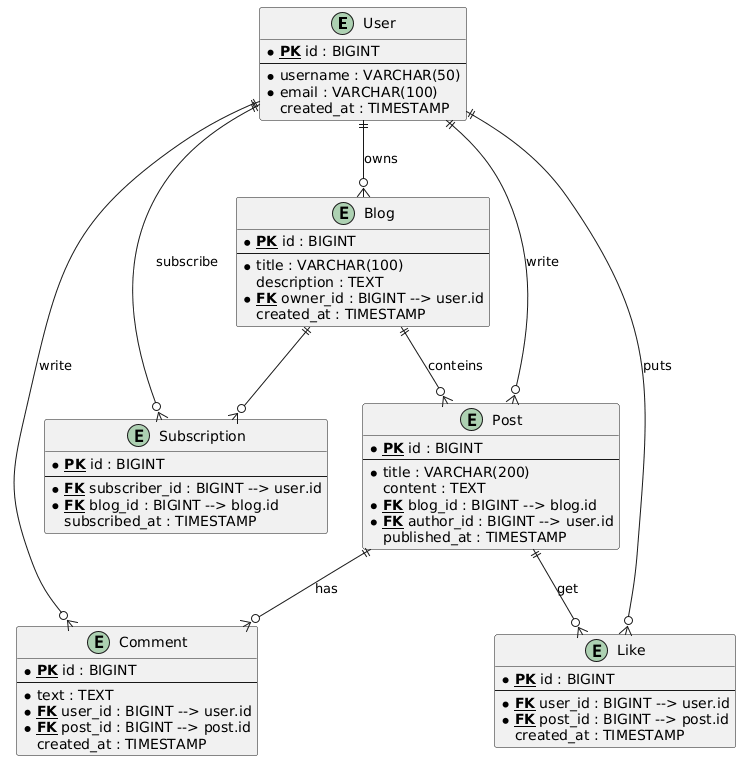

# Лабораторная работа №1: Проектирование реляционной модели данных

## Цель работы

Освоить методологию проектирования реляционных баз данных путем создания концептуальной и логической модели данных для заданной предметной области. Сформировать практические навыки разработки ER-диаграмм и их реализации на языке SQL.

## Задачи работы

1. Проанализировать предложенную предметную область и выделить ключевые сущности (не менее 4 сущностей)
2. Определить атрибуты сущностей и связи между ними (сущности должны находиться в 3NF)
3. Спроектировать ER-диаграмму в нотации PlantUML
4. Реализовать модель данных в виде SQL DDL скрипта
5. Обосновать выбранные типы данных и структуру таблиц


### Вариант 7: Блог-платформа с подписками

**Описание:** Пользователи ведут блоги, публикуют посты. Другие пользователи могут подписываться на блоги, комментировать посты и ставить лайки.

## 1. Анализ предметной области
### Описание
Блог-платформа позволяет пользователям:
- вести собственные блоги;
- публиковать посты в блогах;
- подписываться на блоги других пользователей;
- комментировать посты;
- ставить лайки на посты.


### Сущности 
| № | Сущность | Описание |
|:-:|:---|:---|
| 1 | **User** | Пользователь платформы |
| 2 | **Blog** | Блог, принадлежащий пользователю |
| 3 | **Post** | Пост, опубликованный в блоге |
| 4 | **Comment** | Комментарий под постом |
| 5 | **Like** | Лайк, поставленный пользователем на пост |
| 6 | **Subscription** | Подписка пользователя на блог |

### Атрибуты
| Сущность | Атрибуты | Тип данных | Ограничения |
|:---|:---|:---|:---|
| **User** | `id` (PK) | BIGINT | PRIMARY KEY, AUTO_INCREMENT |
| | `username` | VARCHAR(50) | NOT NULL, UNIQUE |
| | `email` | VARCHAR(100) | NOT NULL, UNIQUE |
| | `created_at` | TIMESTAMP | DEFAULT CURRENT_TIMESTAMP |
| **Blog** | `id` (PK) | BIGINT | PRIMARY KEY, AUTO_INCREMENT |
| | `title` | VARCHAR(100) | NOT NULL |
| | `description` | TEXT | |
| | `owner_id` (FK) | BIGINT | NOT NULL, REFERENCES User(id) |
| | `created_at` | TIMESTAMP | DEFAULT CURRENT_TIMESTAMP |
| **Post** | `id` (PK) | BIGINT | PRIMARY KEY, AUTO_INCREMENT |
| | `title` | VARCHAR(200) | NOT NULL |
| | `content` | TEXT | |
| | `blog_id` (FK) | BIGINT | NOT NULL, REFERENCES Blog(id) |
| | `author_id` (FK) | BIGINT | NOT NULL, REFERENCES User(id) |
| | `published_at` | TIMESTAMP | DEFAULT CURRENT_TIMESTAMP |
| **Comment** | `id` (PK) | BIGINT | PRIMARY KEY, AUTO_INCREMENT |
| | `text` | TEXT | NOT NULL |
| | `user_id` (FK) | BIGINT | NOT NULL, REFERENCES User(id) |
| | `post_id` (FK) | BIGINT | NOT NULL, REFERENCES Post(id) |
| | `created_at` | TIMESTAMP | DEFAULT CURRENT_TIMESTAMP |
| **Like** | `id` (PK) | BIGINT | PRIMARY KEY, AUTO_INCREMENT |
| | `user_id` (FK) | BIGINT | NOT NULL, REFERENCES User(id) |
| | `post_id` (FK) | BIGINT | NOT NULL, REFERENCES Post(id) |
| | `created_at` | TIMESTAMP | DEFAULT CURRENT_TIMESTAMP |
| | | | UNIQUE(user_id, post_id) |
| **Subscription** | `id` (PK) | BIGINT | PRIMARY KEY, AUTO_INCREMENT |
| | `subscriber_id` (FK) | BIGINT | NOT NULL, REFERENCES User(id) |
| | `blog_id` (FK) | BIGINT | NOT NULL, REFERENCES Blog(id) |
| | `subscribed_at` | TIMESTAMP | DEFAULT CURRENT_TIMESTAMP |
| | | | UNIQUE(subscriber_id, blog_id) |

### Свзи
| Связь | Тип | Обоснование |
|:---|:---:|:---|
| User → Blog | 1 : N | Один пользователь может владеть несколькими блогами |
| Blog → Post | 1 : N | Один блог может содержать множество постов |
| User → Post | 1 : N | Один пользователь может написать множество постов |
| User → Comment | 1 : N | Один пользователь может написать множество комментариев |
| Post → Comment | 1 : N | Один пост может иметь множество комментариев |
| User ⇄ Post (лайки) | M : N | Реализуется через сущность `Like` |
| User ⇄ Blog (подписки) | M : N | Реализуется через сущность `Subscription` |


## 2. ER-диаграмма (PlantUML)



## 3. SQL DDL скрипт

```sql
CREATE TABLE users (
    id BIGSERIAL PRIMARY KEY,
    username VARCHAR(50) NOT NULL UNIQUE,
    email VARCHAR(100) NOT NULL UNIQUE,
    created_at TIMESTAMP DEFAULT CURRENT_TIMESTAMP
);

CREATE TABLE blogs (
    id BIGSERIAL PRIMARY KEY,
    title VARCHAR(100) NOT NULL,
    description TEXT,
    owner_id BIGINT NOT NULL,
    created_at TIMESTAMP DEFAULT CURRENT_TIMESTAMP,
    CONSTRAINT fk_blogs_owner FOREIGN KEY (owner_id) REFERENCES users(id) ON DELETE CASCADE
);

CREATE TABLE posts (
    id BIGSERIAL PRIMARY KEY,
    title VARCHAR(200) NOT NULL,
    content TEXT,
    blog_id BIGINT NOT NULL,
    author_id BIGINT NOT NULL,
    published_at TIMESTAMP DEFAULT CURRENT_TIMESTAMP,
    CONSTRAINT fk_posts_blog FOREIGN KEY (blog_id) REFERENCES blogs(id) ON DELETE CASCADE,
    CONSTRAINT fk_posts_author FOREIGN KEY (author_id) REFERENCES users(id) ON DELETE CASCADE
);

CREATE TABLE comments (
    id BIGSERIAL PRIMARY KEY,
    text TEXT NOT NULL,
    user_id BIGINT NOT NULL,
    post_id BIGINT NOT NULL,
    created_at TIMESTAMP DEFAULT CURRENT_TIMESTAMP,
    CONSTRAINT fk_comments_user FOREIGN KEY (user_id) REFERENCES users(id) ON DELETE CASCADE,
    CONSTRAINT fk_comments_post FOREIGN KEY (post_id) REFERENCES posts(id) ON DELETE CASCADE
);

CREATE TABLE likes (
    id BIGSERIAL PRIMARY KEY,
    user_id BIGINT NOT NULL,
    post_id BIGINT NOT NULL,
    created_at TIMESTAMP DEFAULT CURRENT_TIMESTAMP,
    CONSTRAINT fk_likes_user FOREIGN KEY (user_id) REFERENCES users(id) ON DELETE CASCADE,
    CONSTRAINT fk_likes_post FOREIGN KEY (post_id) REFERENCES posts(id) ON DELETE CASCADE,
    CONSTRAINT unique_user_post UNIQUE (user_id, post_id)
);

CREATE TABLE subscriptions (
    id BIGSERIAL PRIMARY KEY,
    subscriber_id BIGINT NOT NULL,
    blog_id BIGINT NOT NULL,
    subscribed_at TIMESTAMP DEFAULT CURRENT_TIMESTAMP,
    CONSTRAINT fk_subscriptions_user FOREIGN KEY (subscriber_id) REFERENCES users(id) ON DELETE CASCADE,
    CONSTRAINT fk_subscriptions_blog FOREIGN KEY (blog_id) REFERENCES blogs(id) ON DELETE CASCADE,
    CONSTRAINT unique_subscriber_blog UNIQUE (subscriber_id, blog_id)
);

```

## 4. Обоснование структуры
Первичные ключи (id) обеспечивают уникальную идентификацию каждой записи. Числовой автоинкрементный ключ эффективнее составных ключей. \
Таблицы subscriptions и likes реализуют связи многие-ко-многим: один пользователь может один раз подписаться на блог и один раз лайкнуть пост. \
Составные первичные ключи предотвращают дублирование записей \
Внешние ключи с ON DELETE CASCADE автоматически удаляют зависимые записи
### Нормализация (3NF)
* Все таблицы имеют первичные ключи
* Отсутствуют повторяющиеся группы
* Нет транзитивных зависимостей
* Все атрибуты зависят только от первичного ключа

### Выбор типов данных
* BIGSERIAL — автоинкремент для первичных ключей
* VARCHAR — строки ограниченной длины
* TEXT — длинные тексты (посты, комментарии)
* TIMESTAMP — хранение даты и времени

